이전 포스팅에서 살펴본 **"Core Web Vitals"**, 각자의 프로젝트에서 코어 웹 바이탈을 개선하기 위한 첫 단계로 어떻게 코어 웹 바이탈을 측정할 수 있는 지에 대해 알아보자.

이것저것 찾아보고 정리하다 보니 크게 개발 시 유용한 측정 도구들과 지속적인 모니터링을 위한 도구들로 나누어졌다.

> _이전 포스팅:_  
> _[웹 성능 지표, 코어 웹 바이탈(CWV)](../2023-10-24-core-web-vitals/index.md)_

<!--truncate-->

## 1. 개발 시 유용한 측정 도구들

<br />

### Lighthouse

Lighthouse는 크롬 웹 스토어에서 다운 받을 수 있는 확장 프로그램이며, 개발자 도구에서도 손쉽게 만나볼 수 있다. Lighthouse는 제공된 URL에 대해 일련의 감사를 실행하는 방식으로 작동하고, 이러한 감사를 기반으로 페이지가 얼마나 잘 수행되었는지에 대한 보고서를 생성한다.

**Performance**, **Accessibility**, **Best Practices**, **SEO**, **PWA** 의 다섯가지 기준에 따라 분석 점수를 확인할 수 있다.

:::warning

타사 플러그인이 보고서에 영향을 미칠 수 있으므로 시크릿 모드에서 Lighthouse 보고서를 실행하는 것이 중요하다.  
(물론 build도 잊지 말아야 !)

:::

이 중 Performance 점수가 현재 페이지의 성능을 측정한 점수이며, 이는 Metrics 지표의 세부 항목을 기준으로 측정된다.

:::info[Lighthouse (v10) 바이탈 가중치]

- 콘텐츠가 포함된 최대 페인트(LCP): 25%
- 총 차단 시간\*(TBT): 30%
- 최초 콘텐츠가 포함된 페인트(FCB): 10%
- 속도 지수(Speed Index): 10%
- 누적 레이아웃 이동(CLS): 25%

\* 첫 입력 지연(FCP)과 유사

:::

<br />

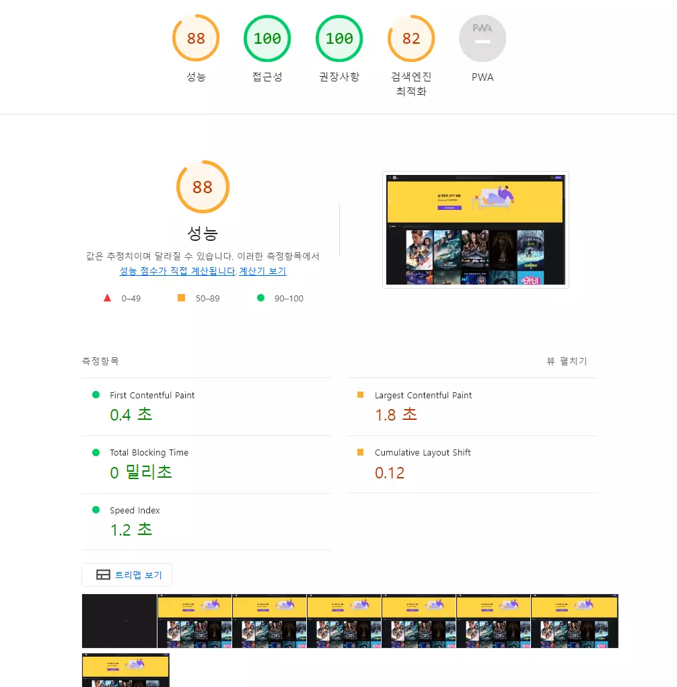

개선이 필요한 영역이 있는 경우 보고서에서 개선 방법에 대한 인사이트도 찾아 볼 수 있다.

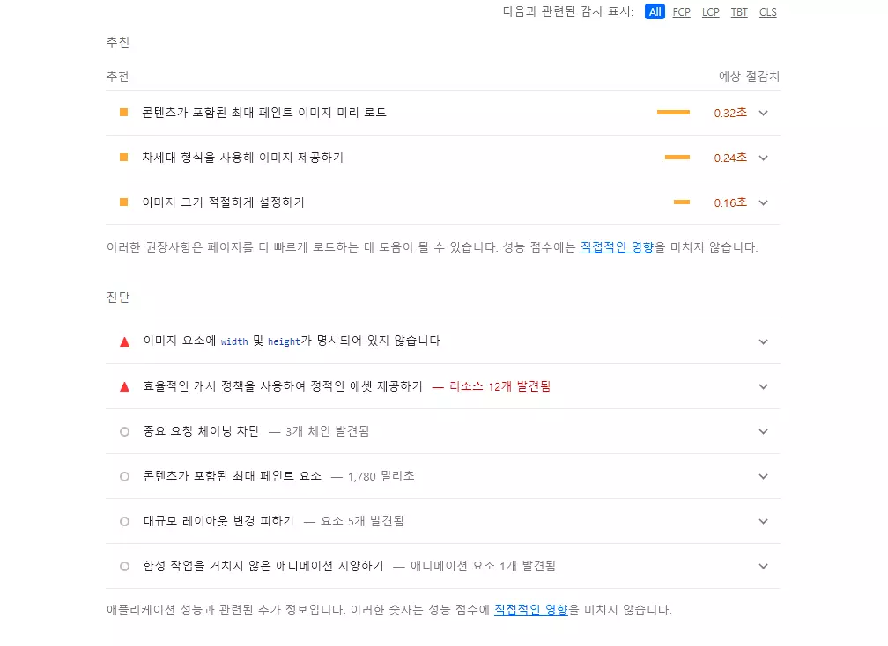


<br />

### Unlighthouse

웹 사이트의 모든 단일 페이지에 대해 Lighthouse 보고서를 실행하는 오픈소스 도구이며 모든 작업을 병렬로 수행하므로 몇 분 안에 수십, 수백 개의 페이지를 분석하여 실행하기 적합하다.


새 디렉토리를 만든 다음 아래 코드로 unlighthouse를 실행하면 웹 사이트의 성능을 보여주는 UI가 나타난다.

```shell
npx unlighthouse --site <your-site>
# OR pnpm dlx unlighthouse --site <your-site>
```

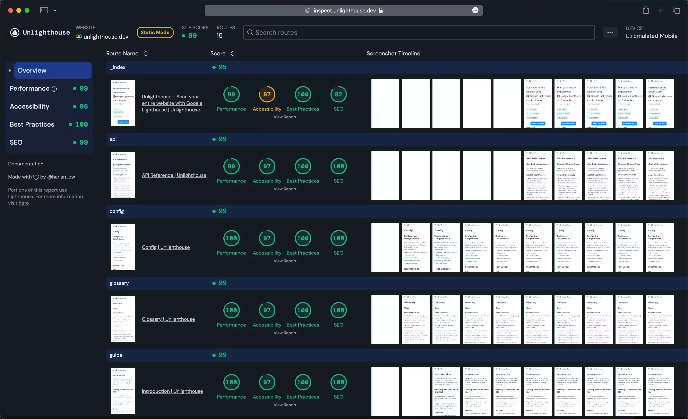

> _Read more:_  
> _[Unlighthouse 공식 사이트](https://unlighthouse.dev/)_

<br />

### Web vital 확장 프로그램

Web Vitals 확장 프로그램은 크롬 웹 스토어에서 무료로 다운로드 받을 수 있으며, 확장프로그램 아이콘을 클릭하면 현재 웹페이지의 코어 웹 바이탈 점수를 확인할 수 있다.

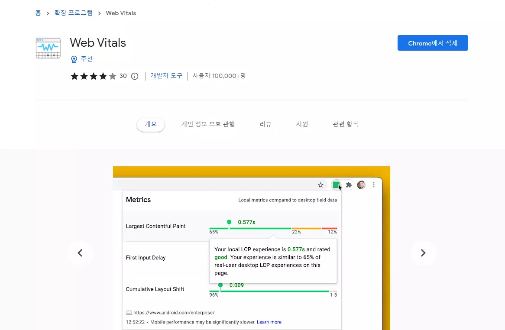

Web Vitals 확장 프로그램은 단순히 점수를 보여주는 것 이상의 기능을 제공하는데, 위 이미지처럼 **Console logging 옵션을 활성화**를 하면, 개발자 도구의 콘솔 창에서 실시간으로 코어 웹 바이탈 점수를 확인할 수 있다.

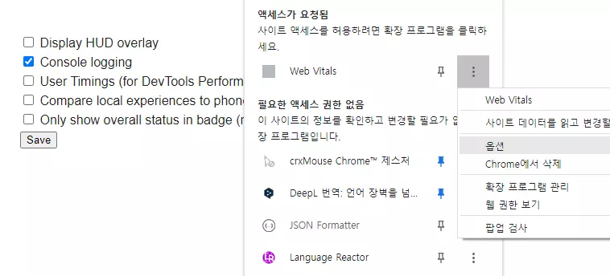

페이지 로드 시간과 같은 실시간 정보뿐만 아니라, LCP(Largest Contentful Paint, 콘텐츠가 포함된 최대 페인트) 요소에 대한 정보도 함께 제공되므로, 웹사이트 성능의 병목 현상을 더욱 쉽게 찾아낼 수 있다.

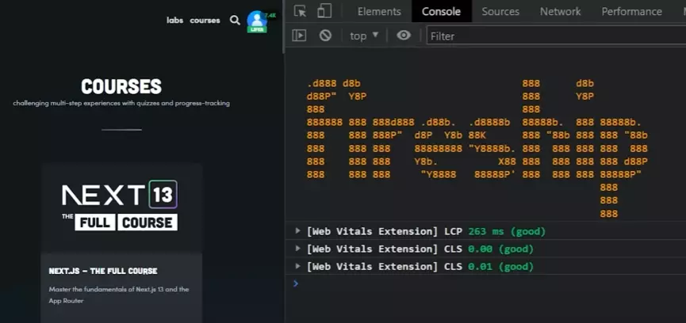

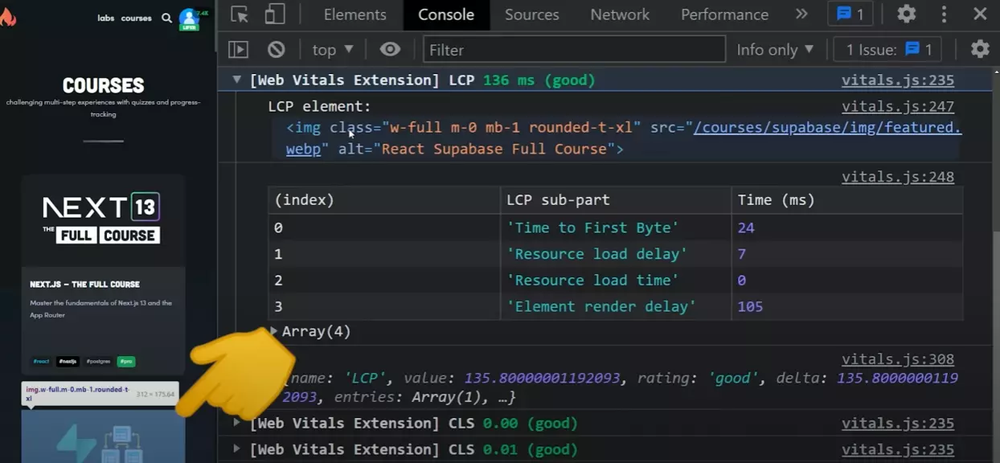

또한 2024년 3월부터 FID(First Input Delay, 최초 입력 반응 시간)를 대체하여 사용자 상호작용에 대한 웹 페이지의 **전반적인 응답성을 평가하는 측정 지표인 INP(Interactive Notification Performance)에 대한 정보도 실시간으로 제공**한다.

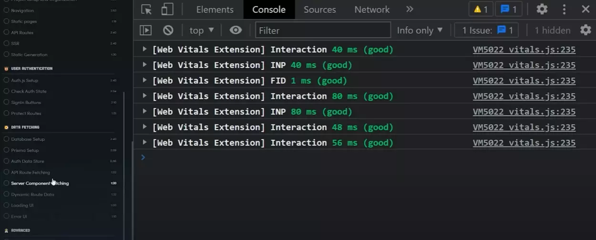

> _Read more:_  
> _[Interaction to Next Paint(다음 페인트와의 상호작용)(INP)  |  Articles  |  web.dev](https://web.dev/articles/inp?hl=ko)_

<br />

---

## 2. 지속적인 모니터링을 위한 도구들

사이트를 최적화한 후에는 계속 반복할 수 있도록 운영 중에 모니터링하는 것이 중요하다. 코어 웹 바이탈을 모니터링할 때는 일회성 lab 테스트에 의존하기보다는 장기간에 걸쳐 추적하는 것이 중요하다.

> _Read more:_  
> _[실험실 및 현장 데이터가 다를 수 있는 이유와 해야 할 일  |  Articles  |  web.dev](https://web.dev/articles/lab-and-field-data-differences?hl=ko)_

<br />

### Google Search Console

구글 서치 콘솔의 페이지 경험 보고서에서는 사이트 방문자의 사용자 환경에 관한 요약을 확인할 수 있다. 구글에서는 사이트의 개별 URL에 관한 페이지 경험 측정항목을 평가하고 이를 구글 검색결과의 URL 순위 결정 신호로 사용한다.

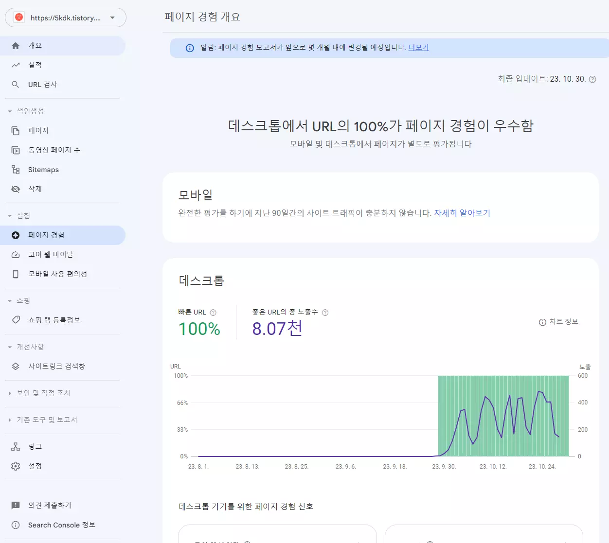

구글 서치 콘솔을 통해 웹사이트의 코어 웹 바이탈를 분석하는 것도 가능하다. 크롤링된 모든 페이지를 '느림', '개선이 필요함', '좋음' 세 가지 카테고리로 분류하여 제공한다. 이를 통해 웹사이트의 각 URL이 코어 웹 바이탈 지표를 충족하는지 쉽게 확인할 수 있다.

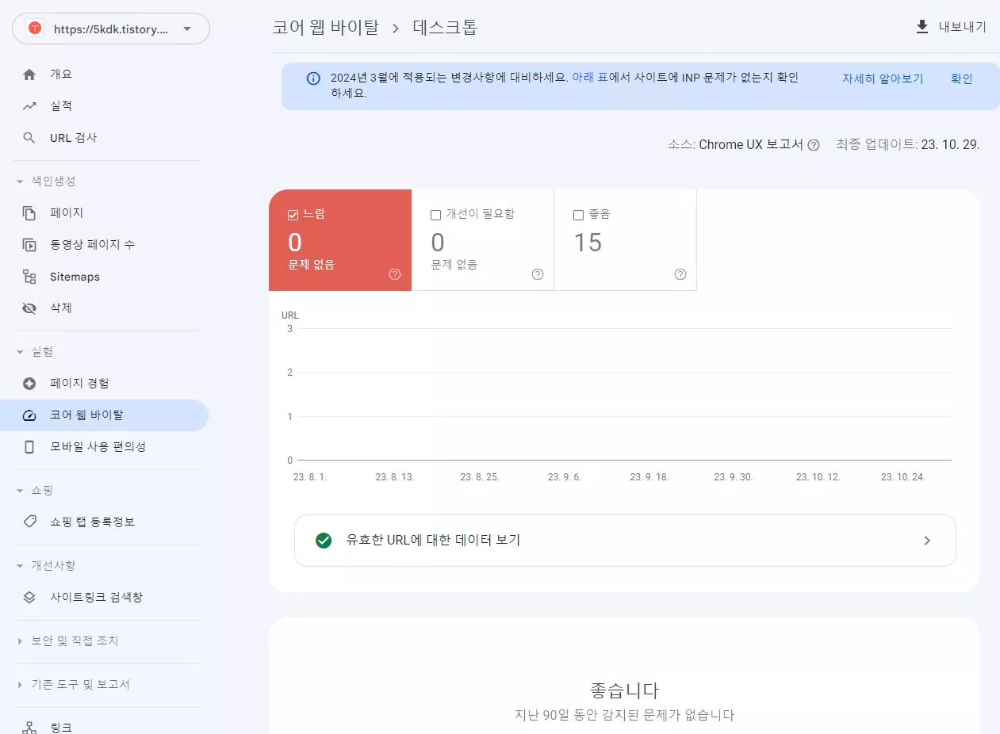

<br />

### PageSpeed Insights

PSI(PageSpeed Insights)의 실제 사용자 환경 데이터는 [Chrome 사용자 환경 보고서](https://developers.google.com/web/tools/chrome-user-experience-report?hl=ko) (CrUX) 데이터 세트를 기반으로 한다. PSI에서는 지난 28일의 수집 기간 동안 실제 사용자의 [첫 번째 콘텐츠 페인트](https://web.dev/fcp/?hl=ko) (FCP), [최초 입력 반응 시간](https://web.dev/fid/?hl=ko) (FID), [콘텐츠가 포함된 최대 페인트](https://web.dev/lcp/?hl=ko) (LCP), [레이아웃 변경 횟수](https://web.dev/cls/?hl=ko) (CLS), [다음 페인트와의 상호작용](https://web.dev/inp/?hl=ko) (INP) 경험을 보고한다. PSI에서는 실험 측정항목인 [TTFB (Time to First Byte)](https://web.dev/ttfb/?hl=ko)의 경험도 보고한다.

<details>
  <summary><b>Chrome 사용자 환경 보고서 (CrUX)</b></summary>
  <div>

:::note

성능을 측정하는 또 다른 훌륭한 무료 오픈소스 방법은 [Chrome 사용자 경험 보고서](https://developers.google.com/web/tools/chrome-user-experience-report) 데이터세트를 사용하는 것이다.

Chrome 사용자 경험 보고서는 실제 Chrome 사용자가 웹에서 인기 있는 목적지를 경험하는 방식에 대한 사용자 경험 지표를 제공한다.

이 데이터 세트는 [BigQuery](https://console.cloud.google.com/bigquery?project=chrome-ux-report&pli=1)에서 공개적으로 사용할 수 있으며, [Google 데이터 스튜디오](https://lookerstudio.google.com/overview?)에서 완전히 무료로 사용할 수도 있다.

다행히도 웹사이트의 성능을 추적하기 위한 템플릿으로 사용할 수 있는 [오픈소스 대시보드](https://lookerstudio.google.com/u/0/datasources/create?connectorId=AKfycbxk7u2UtsqzgaA7I0bvkaJbBPannEx0_zmeCsGh9bBZy7wFMLrQ8x24WxpBzk_ln2i7)가 있다.

이 데이터 세트의 유일한 단점은 웹 사이트가 CrUX 보고서에 포함되려면 의미 있는 방문 횟수가 있어야 하며, 그렇지 않으면 데이터 부족으로 인해 보고서에 포함되지 않는다는 것이다. 따라서 작업 중이거나 최근에 만든 웹사이트에는 적합하지 않을 수 있다.

또한 데이터는 월 단위로 업데이트되며, 보통 한 달이 끝나고 약 15일 후에 데이터를 확인할 수 있으므로 코어 웹 바이탈 점수를 개선하려는 경우 가장 실용적이지 않을 수 있다.

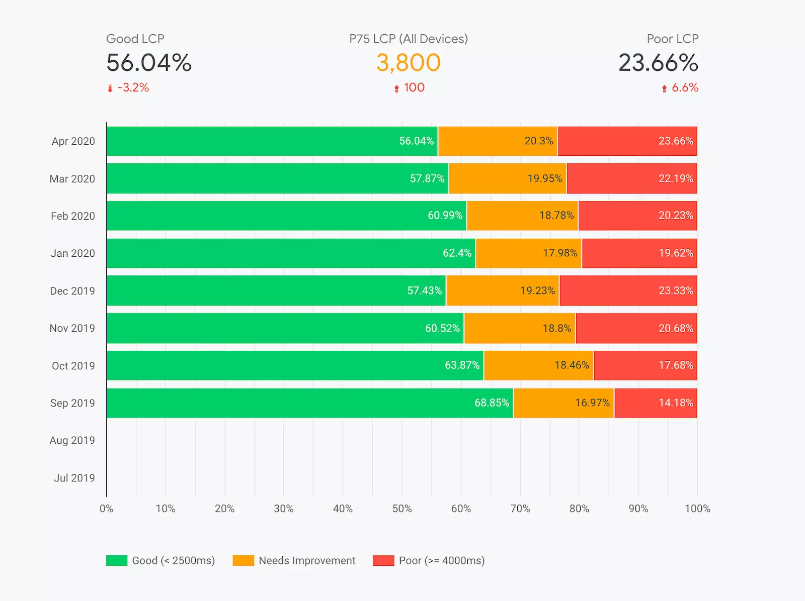

> _Read more:_  
> _Google: [Example Dashboard (copy for free)](https://web.dev/chrome-ux-report-data-studio-dashboard/)_

:::

  </div>
</details>

> _Read more:_  
> [Chrome UX 보고서를 통해 현장 성능 살펴보기](https://web.dev/articles/chrome-ux-report?hl=ko)

특정 페이지의 사용자 환경 데이터를 표시하려면 CrUX 데이터 세트에 포함될 만큼 충분한 데이터가 있어야 한다. 페이지가 최근에 게시되었거나 실제 사용자의 샘플이 너무 적은 경우 데이터가 충분하지 않을 수 있다. 이 경우 PSI는 출처 수준 세부사항으로 되돌아가며, 웹사이트의 모든 페이지에 있는 모든 사용자 환경을 포함한다. 출처에 데이터가 충분하지 않을 때도 있는데, 이 경우 PSI에서 실제 사용자 환경 데이터를 표시할 수 없다.

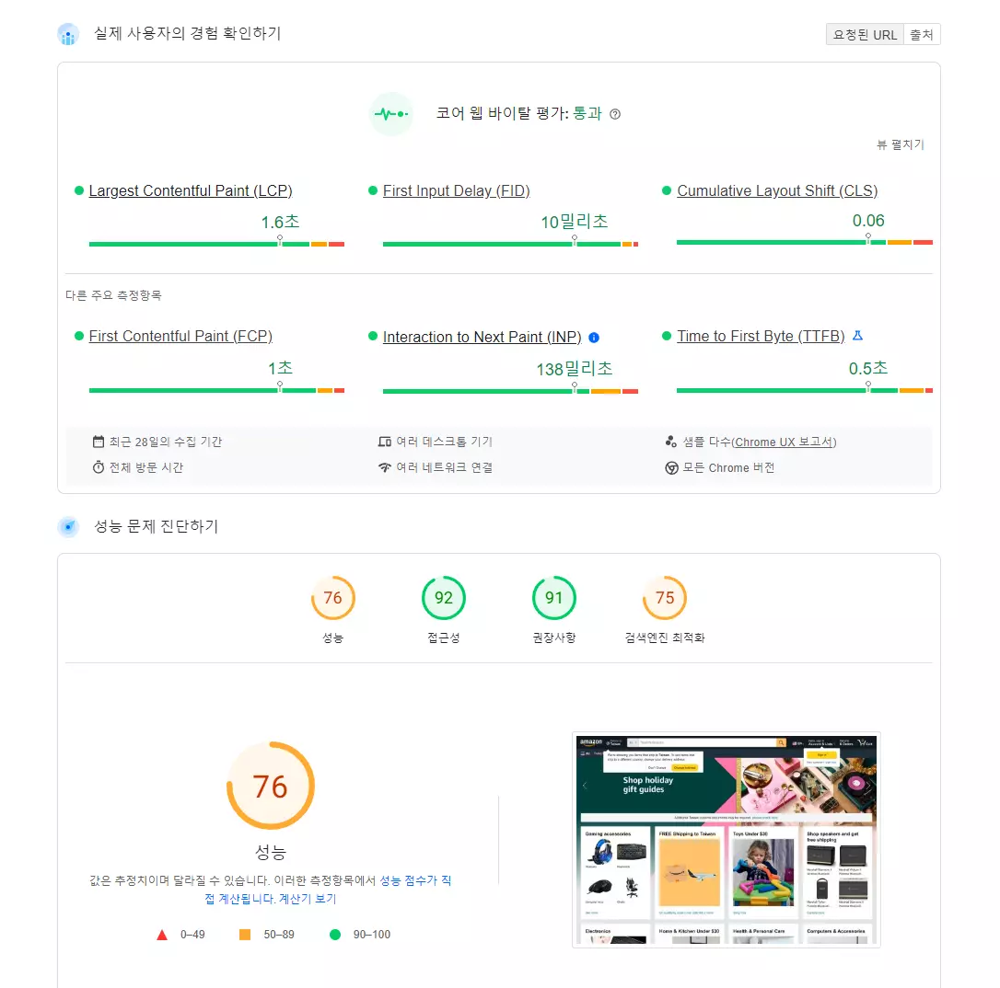

이하는 Lighthouse와 같다.

<br />

### Next.js Speed Insights

[Next.js Speed Insights](https://nextjs.org/analytics) 를 사용하면 코어 웹 바이탈을 사용하여 페이지의 성능을 분석하고 측정할 수 있다.

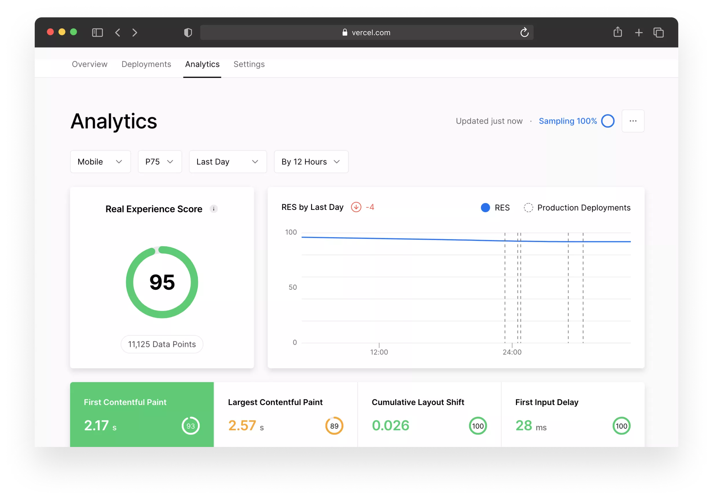

Vercel 배포에서 아무것도 구성하지 않은 상태에서 실제 경험 점수를 수집할 수 있다.

> _Read more:_  
> [Speed Insights Overview](https://vercel.com/docs/concepts/speed-insights?utm_campaign=no-campaign#metrics?utm_source=next-site&utm_medium=learnpages&utm_campaign=no-campaign)

<br />

### 커스텀 레포팅

Next.js Speed Insights에서 사용하는 built-in relayer 를 사용하여 데이터를 자체 서비스로 전송하거나 Google 애널리틱스로 푸시할 수도 있다.

이를 위해 Next.js에서 제공하는 `reportWebVitals` 함수를 활용할 수 있다.

```shell
npx create-next-app@latest nextjs-lighthouse --use-npm --example "https://github.com/vercel/next-learn/tree/main/seo"
```

`pages/_app.js`를 열고 다음 함수를 내보낸다.

```jsx
export function reportWebVitals(metric) {
  console.log(metric); // 콘솔 로그를 사용하여 실시간으로 메트릭을 살펴보는 예시
}
```

그런 다음 애플리케이션을 빌드하고 시작해보면,

```
npm run build && npm run start
```

Chrome을 열면 개발자 도구 콘솔에 메트릭이 표시된다. 또한 페이지와 상호 작용할 때만 **FID**가 트리거된다는 것을 알 수 있다.

> _Read more:_  
> _Next.js: [Measuring Performance](https://nextjs.org/docs/pages/building-your-application/optimizing/analytics)_

---
