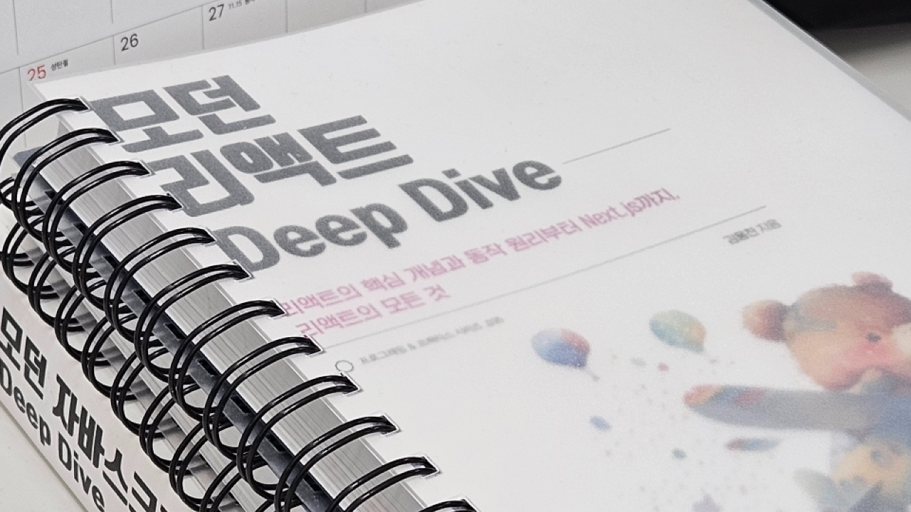

지인에게 **'모던 리액트 Deep dive'** 발간 소식을 듣고, 책 정보를 찾아 보다가 이 책의 저자님이 제가 평소에 감명깊게 보던 블로그의 주인분이라는 것을 알게 되어, 고민 없이 해당 도서의 서포터즈 활동까지 지원하고 책을 구매하였다.

웅모님의 '모던 자바스크립트 Deep dive'로 JavaScript를 깊게 파고들 수 있었던 기억이 있는데, 현업에서 Next.js와 React를 다루고 있어 이 책을 통해 더 깊게 이해하고 실무에 적용하는 것을 기대하게되었다.

위키북스 '모던 리액트 Deep dive'의 서포터즈로 선정되면서 절반정도 읽은 시점의 책의 서평을 간단하게 남겨본다.

<!--truncate-->

## 이 책에서 다루는 내용에 대한 생각

먼저 책에서 다루는 내용을 살펴보면...

- 리액트의 역사
- 리액트를 다루기 위한 자바스크립트 코어 지식
- 리액트의 핵심 요소와 훅
- 서버사이드 랜더링
- 리액트와 상태관리 라이브러리
- 디버깅, 앱 분석 방법
- 좋은 리액트 코드 작성을 위한 환경 구축, 배포 환경 구축
- 리액트 17, 18 변경 사항
- Next.js 13과 리액트 18
- 코어 웹 바이탈
- 웹 성능 측정
- 리액트와 웹페이지 보안 이슈

(임의로 그룹화 함, 목차와는 조금 다름)

책 이름이 **모던 리액트 Deep dive** 지만 React뿐만 아니라 프론트엔드 개발자라면 알아야 할 정보들도 함께 다루고 있다.

나에겐 Next.js와 웹 성능, 보안 등을 함께 다루고 있어 정말 좋은 구성이었지만 React의 사용 방법을 공부하는 느낌은 아니라 이미 React를 다뤄본 사람에게 좀 더 적합한 구성인 것 같다. React 공식문서에는 이 책에서 다루는 중요한 내용이 대거 빠져있는데 공식문서와 이 책을 병행하면 좋으리라 생각한다.

그리고 Next.js 14가 얼마 전 발표되어 새로 발간한 책이지만 이전 버전의 내용을 담아버린 책이 되어버렸다. (14버전이 너무 빨리 나와버렸다. 라이브러리, 프레임워크를 주제로 한 책은 피할 수 없는 부분...) 이런 아쉬운 점은 저자님 블로그 포스팅에서 찾아볼 수 있다.

> [_모던 리액트 Deep dive가 출간되었습니다._](https://yceffort.kr/2023/10/react-deep-dive)

 

## 절반정도 읽은 시점의 느낀점

### 1. React 생태계의 명확한 용어

이전에 읽었던 **'모던 자바스크립트 Deep dive'** 에서는 명확한 용어는 명확한 소통이 된라는 말이 나온다.

이 책은 React 생태계의 용어들을 명확하게 다루고 있어 이 React에 대한 소통 능력을 쌓기 적합하다.

나는 이를 '기본기'라고 생각하는데 이 기본기들은 실제 업무를 할 때 크게 도움이 된다.

예를 들어 같은 개발자여도 지식의 수준이 다를 수 있는데, 가지고 있는 지식이 다르더라도 용어를 정확히 알고 있다면 그 간극을 손쉽게 좁혀나갈 수 있다.

상대방 혹은 내가 모르는 지식이어도 기본기가 있다면(명확한 용어를 알고 있다면) 내 지식을 알려주기에도, 새로운 지식을 받아들이는 데도 수월하다.

### 2. 동작원리를 기반으로한 이해

JavaScript의 동작 원리를 모르고 JavaScript 코드를 짜는 것과 알고 짜는 것이 천지 차이인 듯, React도 마찬가지. 하지만 지금껏 이 책에서 다루는 근본적인 React 지식 정보들을 얻기란 쉽지 않았다.

기존의 문제점을 짚어주고, 이에 대한 해결책들을 동작 원리를 기반으로 설명해 주는 점들이 도움이 많이 되었다.

동작 원리를 이해해야 어느 코드가 좋은 코드인지 판별할 수 있고, 본인이 작성한 코드가 어떻게 동작할지, 즉 예측 가능한 React 코드를 작성하는 데에 큰 도움이 될 것 같다.

### 3. 리액트 구성요소의 다양한 관점을 이해

React를 다루며 나타나는 상반되는 관점에 대해 각 진영을 대변하며 이야기를 나누는 점도 흥미롭다.

이전에 블로깅 했던 주제인 메모이제이션에 내 생각은 이 책을 보면서 좀 더 생각해 봐야 할 구실이 생겼고, 고차컴포넌트(HOC)에 대한 활용 고민도 좀 더 깊어졌다.

 

## 마치며

이 책에 대한 다양한 생각을 적어보았다. 현재 이 책의 내용을 바탕으로 실무 프로젝트에 점진적으로 적용하고 있는 중이다. 마치 능력자 사수에게 코드 리뷰를 받는 듯, 프로젝트에 바로 적용할 수 있는 사례들이 많이 포함되어 있어, 더욱 향상된 코드를 작성해 나갈 수 있을 것 같다.

또, 웹 보안을 주제로 정보를 수집하고 있는 팀 동료들에게 이 책을 강력히 추천하였는데, 동료들이 이 책을 읽은 후 매우 좋다는 반응을 보여주었고, 이 책의 보안 챕터를 중심으로 내용을 정리하고 있다. 이처럼 책은 실무에 종사하는 사람들에게도 큰 도움이 된다.

남은 절반 부분에서는 코어 웹 바이탈과 웹 최적화에 대한 내용이 포함되어 있어 이전에 혼자 검색하여 공부했던 지식과 비교해보면서 확인할 수 있는 기회가 될 것 같다.

Deep dive 시리즈는 모두 깊은 지식을 다루기 때문에, 이 책을 통해 React를 처음 배우려는 사람에게는 내용이 다소 복잡하게 느껴질 수 있다. 따라서, JavaScript와 React를 먼저 다루어본 후 이 책을 구매하여 깊게 공부하는 것을 추천한다. 만약 이미 React를 다루어봤다면, 말할 것도 없이 이 책을 강력히 추천하고 싶다.

> [yes24 - 모던 리액트 Deep dive](https://www.yes24.com/Product/Goods/123161563)  
> [저자 김용찬님의 블로그](https://yceffort.kr/)
