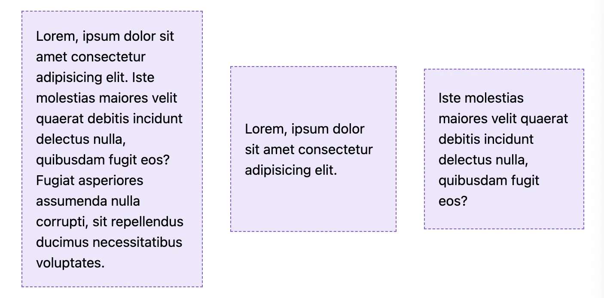
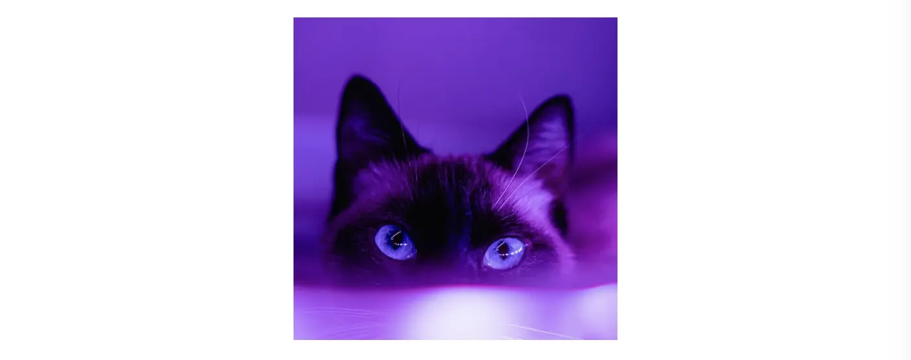
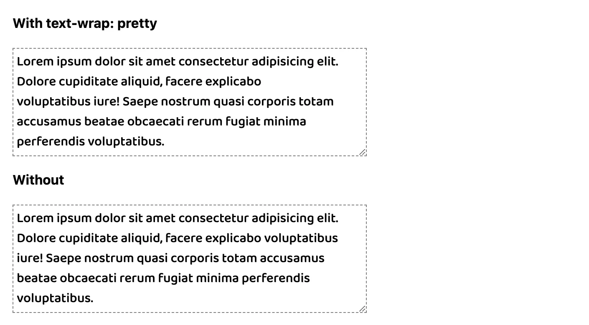

프로젝트 대부분을 sass를 사용하면서, 프로젝트 멤버가 바뀌거나 다른 개발자의 스타일을 수정하며 사뭇 두려워질 때면 style도 js,ts 코드와 마찬가지로 개선해 나가는 게 중요하다고 느끼게 된다.

style도 레거시가 될 수 있는데 이에 도움될뿐 아니라 심지어 스크립트를 제거하여 손쉽게 사용자 경험의 성과를 보여줄 수 있는 최신 css의 12가지 속성에 대해 알아보자.

<!--truncate-->

참고한 아티클의 저자는 속성들을 3가지로 나누었다.

> - **안정적인 업그레이드**: 오래된 기술을 대체하여 해킹(꼼수)이나 문제를 해결한다.
> - **안정적인 개선**: 잘 지원되는 최신 속성으로 향상된 경험을 제공한다.
> - **점진적인 개선**: 지원되지 않는 브라우저에서 피해를 주지 않고 해당 속성이 지원되는 경우 업그레이드된 환경을 제공한다.
>
> _Stephanie Eckles_

<br />

## 안정적인 업그레이드 (Stable Upgrade)

다음과 같이 잘 지원되는 속성은 오래된 기술을 대체하여 해킹이나 오랜 문제를 해결하는 데 도움이 될 수 있다.

<br />

### aspect-ratio

`aspect-ratio` 속성은 브라우저에서 안정적이며 화면 비율을 정의하는 데 필요한 유일한 속성이다.

> 동영상 임베드에 16:9와 같은 화면 비율을 강제로 적용하기 위해 'padding hack'을 사용한 적이 있나요?

동영상의 경우 대부분, `aspect-ratio: 16/9`만 사용하면 되며, 정사각형의 경우, 암시적인 두 번째 값도 1이므로 `aspect-ratio: 1`만 필요하다.

```css
.aspect-ratio-hd {
  aspect-ratio: 16/9;
}

.aspect-ratio-square {
  aspect-ratio: 1;
}
```


참고로 해당 속성을 적용하면 콘텐츠가 우선순위를 가질 수 있다. 즉, 콘텐츠로 인해 요소가 적어도 한 차원 에서 비율을 초과하는 경우에도 콘텐츠에 맞게 요소가 커지거나 모양이 변경된다. 이 동작을 방지하거나 제어하려면 `max-width`와 같은 추가 속성을 추가하여 flex 또는 grid 컨테이너 밖으로 확장되지 않도록 할 수 있다.

```css
/* Applied to the flexbox children which have a size constraint from their parent */
.aspect-ratio-square {
  aspect-ratio: 1;
}
```



<br />

### object-fit

`object-fit`을 사용하면 img 또는 기타 replaced element가 해당 콘텐츠의 컨테이너 역할을 하고 해당 콘텐츠가 `background-size`와 유사한 크기 조정 동작을 적용하게 된다.

`object-fit`에 가장 많이 사용하는 값은 다음과 같다.

- **cover** : 이미지가 요소를 덮도록 크기가 조정되고 콘텐츠가 왜곡되지 않도록 `aspect-ratio`가 유지된다.
- **scale-down** : 이미지가 잘리지 않고 완전히 보이도록 요소 내에서 필요한 경우 이미지 크기를 조정하고 `aspect-ratio`를 유지하므로 요소의 렌더링 `aspect-ratio`가 다른 경우 이미지 주변에 여분의 공간이 생길 수 있다.

```css
.image {
  object-fit: cover;
  aspect-ratio: 1;

  /* Optional: constrain image size */
  max-block-size: 250px;
}
```



<br />

### margin-inline

`margin-inline`은 인라인(가로 쓰기 모드에서 왼쪽 및 오른쪽) 여백을 설정하는 약어 역할을 한다.

변경은 간단하다.

```css
/* before */
margin-left: auto;
margin-right: auto;

/* after */
margin-inline: auto;
```

논리적 속성은 몇 년 전부터 사용 가능했으며 현재 98% 이상의 지원율을 보이고 있고, 때로 접두사와 함께 쓰이기도 한다.

<br />

## 안정적인 개선

잘 지원되는 최신 CSS 속성은 향상된 경험을 제공할 수 있으며, 이전 방법이나 자바스크립트 지원 솔루션을 대체할 수도 있다. 특정 애플리케이션의 고려 사항에 따라 다르지만 대체 솔루션이 필요하지 않을 수 있으며, 항상 테스트를 권장한다.

<br />

### text-underline-offset

`text-underline-offset`을 사용하면 텍스트 기준선과 밑줄 사이의 거리를 제어할 수 있다. 이 속성은 다음과 같이 적용되는 nomalize의 일부가 되었다.

```css
a:not([class]) {
  text-underline-offset: 0.25em;
}
```

이 속성은 border, 가상 요소 또는 그라데이션 배경과 같은 오래된 hack을 대체할 수 있다.

- `text-decoration-color` : 밑줄 색상을 변경
- `text-decoration-thickness` : 밑줄 획 굵기를 변경

<br />

### outline-offset

focus된 요소와 outline 사이의 거리가 필요할 때 `box-shadow`나 의사 요소를 사용하여 사용자 지정 outline을 사용하는 트릭을 사용한적이 있을 수 있다.

오래 전부터 사용 가능했던 outline-offset 속성을 놓쳤을 수도 있는데, 이 속성을 사용하면 양수 값을 가진 요소에서 아웃라인을 밀어내거나 음수 값을 가진 요소로 끌어당길 수 있다.

```css
.outline-offset {
  outline: 2px dashed blue;
  outline-offset: var(--outline-offset, 0.5em);
}
```

회색 실선은 요소 border고 파란색 점선은 `outline-offset`을 통해 배치되는 outline이다.


> **Note:**  
> outline은 요소 box size의 일부로 계산되지 않으므로 거리를 늘려도 요소가 차지하는 공간은 늘어나지 않는다. 요소 크기에 영향을 주지 않고 box-shadow가 렌더링되는 방식과 유사하다.

<br />

### scroll-margin-top/bottom

`scroll-margin` 속성들(및 해당 scroll-padding)을 사용하면 스크롤 위치의 컨텍스트에서 요소에 오프셋을 추가할 수 있다. 즉, `scroll-padding-top`을 추가하면 요소 위의 스크롤 오프셋이 증가하지만 문서 내 레이아웃 위치에는 영향을 주지 않는다.

이것이 왜 유용할까? a 태그가 활성화되었을 때 콘텐츠를 가리는 고정 탐색 요소로 인해 발생하는 문제를 완화할 수 있다. `scroll-margin-top`을 사용하면 내비게이션을 통해 스크롤할 때 요소 위의 공간을 늘려서 고정 내비게이션이 차지하는 공간을 고려할 수 있습니다.

`[id]` 속성이 있는 모든 요소는 a태그가 될 가능성이 있으므로 base style에 포함 시키는것이 좋다.

```css
[id] {
  scroll-margin-top: 2rem;
}
```

<br />

### color-scheme

테마를 사용자 지정하는 `prefers-color-scheme` 미디어 쿼리에 익숙할 것이다. CSS `color-scheme` 속성은 양식 컨트롤, 스크롤바, CSS 시스템 색상을 포함한 브라우저 UI 요소를 조정하기 위한 Opt-in이다. 이 조정은 브라우저에 해당 항목을 light 또는 dark로 렌더링하도록 요청하며, 이 속성을 통해 기본 설정 순서를 정의할 수 있다.

전체 애플리케이션에 적용하는 경우, dark 테마를 기본 설정하거나 순서를 뒤집어 light 테마를 기본 설정하도록 :root에 다음을 설정한다.

```css
:root {
  color-scheme: dark light;
}
```

대비를 향상시키기 위해 어두운 배경의 요소 내에서 양식 컨트롤을 조정하는 등 개별 요소의 color scheme을 정의할 수도 있다.

```css
.dark-background {
  color-scheme: dark;
}
```

<br />

### accent-color

체크박스나 라디오 버튼의 색상을 변경하려면 이 속성을 사용하면 라디오 버튼과 체크박스의 `:checked` 와 진행률 요소 및 범위 input 모두에 대해 채워진 상태를 수정할 수 있다.

```css
:root {
  accent-color: mediumvioletred;
}
```

<br />

### width:fit-content

`display: inline-block`과 같은 인라인 표시 값을 사용하여 요소의 너비를 콘텐츠 크기에 맞게 줄였다면, `width: fit-content`로 업그레이드하면 동일한 효과를 얻을 수 있다. `width: fit-content`의 장점은 display 값을 그대로 유지하므로 레이아웃에서 요소의 위치도 조정하지 않는 한 변경되지 않는다는 것. 계산된 box 크기는 `fit-content`로 생성된 치수에 맞게 조정된다.

```css
.fit-content {
  width: fit-content;
}
```


<br />

## 점진적인 개선

이 마지막 파트는 지원되는 경우 업그레이드된 경험을 제공하고, 지원되지 않는 브라우저에서는 문제 없이 사용할 수 있다.

즉, 최신 CSS에 최근에 추가되었더라도 대체 방법이 필요하지 않다.

<br />

### overscroll-behavior

포함된 스크롤 영역(오버플로우가 허용되는 제한된 크기의 영역)의 기본 동작은 요소에서 스크롤이 끝나면 스크롤 상호 작용이 백그라운드 페이지로 전달되는 것이다. 이는 작게는 사용자에게 혼란을 주고 최악의 경우 불만을 야기할 수 있다.

`overscroll-behavior: contain`은 스크롤을 포함된 영역으로 격리하여 스크롤 경계에 도달하면 상위 페이지로 이동하여 스크롤을 계속하지 못하도록 한다. 이 기능은 긴 글이나 문서 페이지 등 메인 페이지 콘텐츠와 독립적으로 스크롤할 수 있는 네비게이션 링크의 사이드바와 같은 상황에서 유용하다.

```css
.sidebar,
.article {
  overscroll-behavior: contain;
}
```

<br />

### text-wrap

2023년 기준 최신 속성 중 하나인 `text-wrap`은 불균형한 줄의 타입 설정 문제를 해결하는 두 가지 값을 가지고 있다. 여기에는 마지막 텍스트 줄에 혼자 있는 외로운 단어를 설명하는 'orphan(외톨이 단어)'를 방지하는 기능이 포함된다. 외톨이 단어는 텍스트의 마지막 줄에 홀로 있는 단어를 말한다.

첫 번째 사용 가능한 값은 balance로, 텍스트 한 줄당 글자 수를 균등하게 맞추는 것을 목표로 한다.

래핑된 텍스트는 6줄로 제한되므로 헤드라인이나 기타 짧은 텍스트 구절에 이 기술을 사용하는 것이 가장 좋다. 적용 범위를 제한하면 페이지 렌더링 속도에 미치는 영향을 제한하는 데도 도움이 된다.

```css
:is(h1, h2, h3, h4, .text-balance) {
  text-wrap: balance;

  /* 데모용 */
  max-inline-size: 25ch;
}
```


다른 값인 `pretty`는 외톨이 단어를 구체적으로 다루며 보다 광범위하게 적용할 수 있다. `pretty` 알고리즘은 텍스트 블록의 마지막 네 줄을 평가하여 마지막 줄에 두 개 이상의 단어가 포함되도록 필요에 따라 조정을 수행한다.



`text-wrap`은 점진적으로 크게 개선된 기능이다. 하지만 조정해도 요소의 계산된 너비는 변경되지 않으므로 일부 레이아웃에서는 텍스트 옆에 원치 않는 공백이 늘어나는 부작용이 발생할 수 있다.

<br />

### scrollbar-gutter

일부 시나리오에서는 스크롤바가 나타나거나 사라져 원치 않는 레이아웃 이동(CLS)이 발생할 수 있다. 예를 들어, 다이얼로그 오버레이가 표시되고 배경 페이지에 `overflow:hidden`이 추가되면 스크롤을 방지하기 위해 숨겨져 더 이상 필요하지 않은 스크롤 막대를 제거하지 않아도 된다.

최신 CSS 속성인 `scrollbar-gutter`을 사용하면 레이아웃에서 스크롤바를 위한 공간을 예약할 수 있어 원치 않는 이동을 방지할 수 있다. 스크롤바가 필요하지 않은 경우에도 브라우저는 스크롤 컨테이너의 패딩에 추가적으로 생성된 여분의 공간으로 여백을 그린다.

:::caution 중요

이 속성은 사용자의 시스템 설정이 스크롤바를 'overlay'로 설정하지 않은 경우에만 영향을 미치며, Mac OS의 기본값과 같이 스크롤바를 활발하게 스크롤 중인 콘텐츠에만 오버레이로 표시돤다. 오버레이 스크롤바를 사용할 때 의도한 공간을 모두 잃게 되므로 scrollbar-gutter을 없애기 위해 패딩을 삭제해서는 안 된다.

:::

시각적으로 명백한 여분의 공간이므로 `scrollbar-gutter: stable both-edges` 두 가지 키워드를 사용하여 이 속성을 할당할 수 있다. `stable`만 단독으로 사용하면 스크롤 막대가 있을 자리에 여백만 추가되지만, `both-edges` 환경설정을 추가하면 스크롤 컨테이너의 반대쪽에도 공간이 추가된다. 이렇게 하면 레이아웃에 스크롤바를 표시할 필요가 없을 때 시각적 균형을 유지할 수 있다.

> **참고 지료:**
>
> [Moderncss dev](https://moderncss.dev/12-modern-css-one-line-upgrades/)
