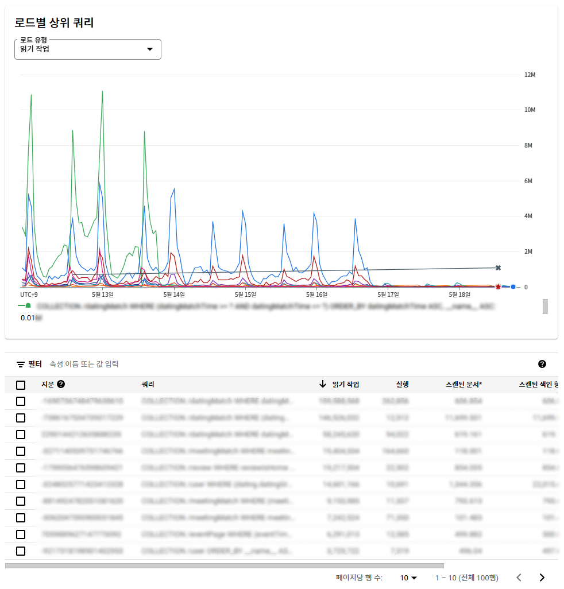
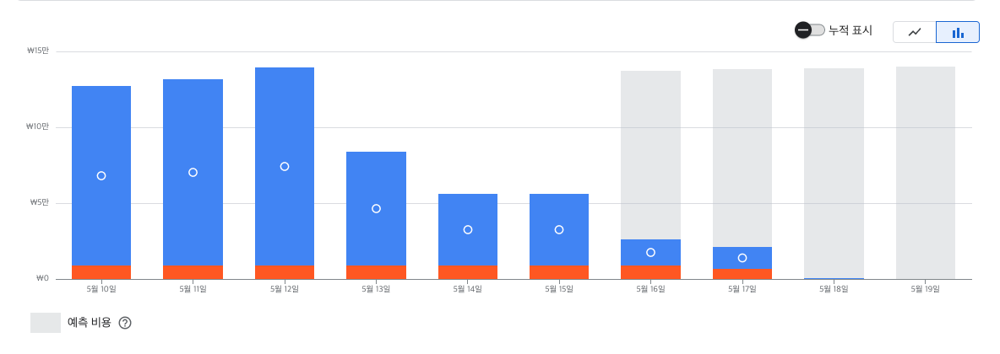
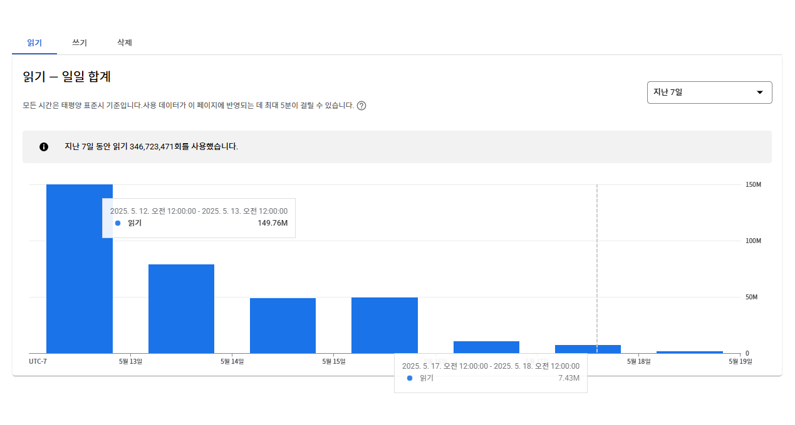

지난주 유저 CS를 처리하던 중 Firebase 콘솔에서 **예상치 못한 요금 폭탄**을 발견했습니다.

이 서비스는 별도 백엔드 없이 Firebase를 사용 중인데요.

매칭 서비스 특성상 봄이 성수기이기에 유저 및 트래픽이 증가하긴 했지만, 특히 **주요 페이지 개편 이후 요금이 비정상적으로 치솟았다**는 사실을 알게 됐습니다.

이 문제를 계기로 **새로 작성한 코드부터 레거시 코드까지 전수 점검**했고, 결과적으로 현재까지 Firebase 비용을 기존 대비 **80% 이상 절감**할 수 있었습니다.

이 글에서는 그 과정을 공유합니다.

<!-- truncate -->

<br />

## 비용 절감 시작의 트리거가 된 Poop code

매칭 페이지를 리뉴얼하면서 **"오늘 몇 건의 매칭이 있었는지"** 보여주는 UI를 추가했습니다.  
구현은 간단했습니다. `getDocs()`로 매칭 데이터를 모두 읽고, 배열 `length`를 구하는 방식이었죠.

```tsx
const fooMatchCollectionRef = collection(
  firestore,
  collectionConstant.fooMatch
);

const q = query(
  fooMatchCollectionRef,
  where('fooMatchTime', '>=', startOfYesterday),
  where('fooMatchTime', '<=', endOfYesterday)
);

const querySnapshot = await getDocs(q);
return querySnapshot.docs.map((doc) => ({
  docId: doc.id,
  ...doc.data(),
}));
```

사실 이 방식의 **비용 리스크**를 인지하고 팀원과 논의했지만, 빠른 출시를 위해 일단 적용하고 나중에 개선하자는 결정이 있었습니다.

**하지만 이것이 요금 폭탄의 시작이었습니다.**

:::note App engine 일일 비용

개편 전날 비용 : ￦70,000  
개편 후 비용 : ￦110,000

:::

매칭 서비스 특성상 매일 수천 건의 매칭 데이터가 생성되었고, 유저가 접속할 때마다 해당 데이터를 모두 읽는 구조였기 때문입니다.

게다가 최근 알고리즘 조정으로 매칭 데이터가 1.5배 증가하면서 **유저 수 × 매칭 수 만큼** 호출이 기하급수적으로 늘어났습니다.

Firebase는 소규모 프로젝트에서 가볍게 써본 적은 있었지만, 실제 프로덕션 과금을 이렇게 체감한 건 처음이었습니다.

**기존 코드베이스를 그대로 확장했지만, 그게 잘못된 선택이었다는 걸 뒤늦게 깨달았습니다.**

:::info Firebase 과금 체계

- Firestore는 반환하는 **문서 수**에 따라 과금됩니다.
- `getDocs` 호출 시 문서 개수를 세기 위해 전체 문서를 읽으면 **문서 수만큼 읽기 비용**이 발생합니다.
- 단순히 개수만 필요한 경우에도 전체 데이터를 읽으면 **불필요한 비용이 쌓입니다**.

:::

<br />

## 불필요한 비용 절감하기

### GoogleCloud Firestore 쿼리 통계 확인

Firebase 콘솔에서는 대략적인 사용량만 제공해 쿼리별 비용 분석이 어렵습니다.  
하지만 [**Google Cloud Console**](https://console.cloud.google.com/)의 모니터링 기능을 활용하면

- 쿼리당 호출 수
- 인덱스 스캔 여부
- 에러 발생 비율

등 **정밀한 데이터를 확인**할 수 있습니다.



덕분에 **가장 문제가 되는 쿼리**를 찾아내고, **어떤 쿼리를 우선 줄여야 할지** 개선 방향을 세울 수 있었습니다.

<br />

### getCount()를 활용한 호출 최적화

NoSQL DB는 SQL처럼 `COUNT`, `SUM`, `AVG` 같은 집계 기능을 기본 제공하지 않습니다.  
보통 별도 집계 필드를 두거나 서버 API를 만들어 대응하는데요.

문제는 저희가 사용하는 `firestore/lite SDK` 는 서버 함수를 제공하지 않는 **경량화 버전**이었습니다.

:::info `firestore/lite SDK`

- REST API 기반 경량 SDK로 기본 CRUD만 제공해 **번들 크기를 80% 이상 줄인 패키지**

:::

다행히 2023년에 추가된 **`getCount()`** API를 활용하면 문서 전체를 읽지 않고 **문서 수만 반환**할 수 있어 불필요한 비용을 줄일 수 있었습니다.

```tsx
const collectionRef = collection(firestore, collectionConstant.fooMatch);

const q = query(
  collectionRef,
  where('fooMatchTime', '>=', startOfYesterday),
  where('fooMatchTime', '<=', endOfYesterday)
);

const querySnapshot = await getCount(q);

return querySnapshot.data().count;
```

이렇게 바꾸자 **매번 수천 건씩 읽히던 호출이 단 1건**으로 줄었고, 콘솔 통계에서도 바로 비용이 줄어든 걸 확인할 수 있었습니다.

> _firestore 빌드 문서의 집계 쿼리 문서에는 firestore SDK 기준 설명만 있어,  
> firestore/lite 패키지 레퍼런스를 찾아가야 겨우 확인할 수 있던 점이 아쉬웠습니다._

<br />

### 복합 인덱스 활용으로 쿼리 최적화

레거시 코드에는 **불필요하게 많은 문서를 읽는 쿼리**가 여럿 있었습니다. 이를 **복합 인덱스**를 추가해 **정확히 필요한 데이터만 조회**하도록 개선했습니다.

```tsx
const collectionRef = collection(firestore, collectionConstant.fooMatch);

const querySnapshot =
  userGender === 1
    ? await getDocs(
        query(
          collectionRef,
          where('userIdMale', '==', userId),
          where('matchDate', '>=', fiveDaysAgo)
        )
      )
    : await getDocs(
        query(
          collectionRef,
          where('userIdFemale', '==', userId),
          where('matchDate', '>=', fiveDaysAgo)
        )
      );

const returnData = querySnapshot.docs.map((doc) => ({
  docId: doc.id,
  ...doc.data(),
}));

return returnData as FooMatchType[];
```

이렇게 바꾸고 나서 **불필요한 읽기 비용**을 눈에 띄게 줄일 수 있었습니다.

<br />

### Next.js ISR 활용으로 세션별 호출 줄이기

`getCount()`를 적용해도 **DAU × 세션 수만큼 호출**이 여전히 발생했습니다.

이런 문제를 해결하기 위해 **Next.js의 ISR (Incremental Static Regeneration)** 기능을 적극 도입했습니다.

예를 들어, **유저 통계**, **매칭 통계**, **리뷰 통계**처럼 **실시간 반영이 필요 없는 데이터**를 정적 페이지로 캐싱해 **서버 호출 없이 재사용**하도록 개선했습니다.

```tsx
export async function getStaticProps() {
  const [userCount, FooMatchCount, BarMatchCount, reviewCount] =
    await Promise.all([
      UserCollection.readCount(),
      FooMatchCollection.readCompleteMatchCount(),
      BarMatchCollection.readCompleteMatchCount(),
      ReviewCollection.readReviewCount(),
    ]);

  return {
    props: {
      userCount: userCount,
      matchCount: FooMatchCount + BarMatchCount,
      reviewCount: reviewCount,
    },
    revalidate: 60 * 60 * 24, // 하루마다 갱신
  };
}
```

덕분에 **서버 호출 수가 크게 줄었고**, 사용자 체감 속도도 개선됐습니다.

<br />

### 미사용 prefetch 제거

서버 상태 관리를 위해 **React Query**를 사용 중이었는데,  
**ISR로 캐싱된 데이터가 있음에도 불구하고** 레거시 코드의 **불필요한 prefetch**가 동작하고 있었습니다.

이를 **필요한 시점에만 fetch**하도록 수정해 **중복 호출과 리소스 낭비를 제거**했습니다.

<br />

## 최적화 전후 비용 비교

최적화 이후 **Firebase Console**과 **Google Cloud Console**을 통해  
비용과 호출량 변화를 비교해 보았습니다.




| 항목                 | 최적화 전 ( 실제 / 개편전 ) | 최적화 후    | 절감률 (실제 / 개편전 ) |
| -------------------- | --------------------------- | ------------ | ----------------------- |
| 일일 읽기 수         | 약 1억 4000만 회 / 9000만회 | 약 750만 회  | 95% / 92%               |
| 일일 App engine 요금 | 약 ￦ 120,000 / ￦80,000    | 약 ￦ 14,000 | 89% / 83%               |

> \* 개편전은 치솟은 비용 기능을 제외할 때 예상 읽기 수, 비용입니다.

**읽기 호출 수가 약 17분의 1 수준으로 줄면서, 비용도 자연스럽게 크게 절감**된 것을 확인할 수 있었습니다.

아직도 **클라우드 매칭 알고리즘의 호출**, **모든 레거시 쿼리 최적화**, **비효율적인 데이터 구조 개선** 같은 과제가 남아 있어 비용 절감 여지는 충분히 더 남아 있습니다.

<br />

## 마치며

이번 경험을 통해 **서버리스 구조라고 해서 무조건 저렴하거나 관리가 필요 없는 것은 아니라는 사실**을 절감했습니다.
빠른 출시를 위해 가볍게 넘긴 결정이 예상치 못한 비용 폭탄으로 돌아올 수 있기 때문입니다.

다행히 문제를 인지하고 짧은 **3일간의 집중 작업**으로
가장 큰 비용을 차지하던 주요 원인을 찾아 **일일 비용을 80% 이상 줄이는 성과**를 얻을 수 있었습니다.

하지만 이번에 개선한 건 어디까지나 가장 시급했던 읽기 문제만 해결한 1차 작업일 뿐,
아직도 클라우드 알고리즘 호출, 레거시 쿼리 최적화, 비효율적인 데이터 구조 개선처럼
**남은 개선 과제가 많이 남아 있습니다**.

이후에도 꾸준히 개선해 나가면서, 비용은 물론 **서비스 품질까지 함께 최적화**해 나갈 계획입니다.

이 글이 **비슷한 비용 문제를 겪고 계신 분들께 작은 힌트**라도 되었기를 바랍니다.

비슷한 고민을 하고 계시다면 아래 문서들도 함께 참고해 보시길 추천드립니다.

- [Firestore/lite 공식 문서 - API 레퍼런스](https://firebase.google.com/docs/reference/js/firestore_lite)
- [Firebase 공식 문서 - 집계 쿼리](https://firebase.google.com/docs/firestore/query-data/aggregation-queries)
- [Firebase 공식 문서 - Firestore 인덱스 최적화](https://firebase.google.com/docs/firestore/query-data/indexing)
- [Next.js 공식 문서 - ISR](https://nextjs.org/docs/pages/building-your-application/data-fetching/incremental-static-regeneration)
- [Google Cloud Monitoring 시작하기](https://cloud.google.com/monitoring/docs)
- [TanStack Query 공식 문서](https://tanstack.com/query/latest)

<br />
