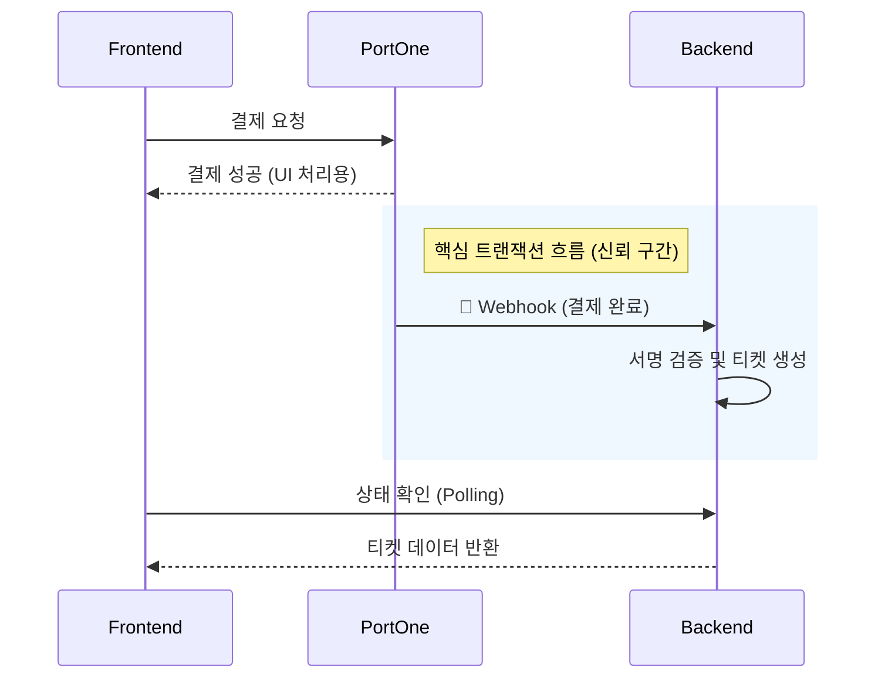

"결제되었다고 알림이 왔는데, 왜 티켓 보관함에는 티켓이 없나요?"

공연 플랫폼 서비스 운영 중 CS가 접수되었다. 로그를 확인해 보니 결제 솔루션(PortOne) 콘솔에는 결제 내역이 있는데, 정작 우리 서비스 DB에는 해당 주문에 대한 상품(ex: 티켓)이 생성되지 않은 상태였다.

이 포스팅은 **프론트엔드 중심의 결제 처리 방식**에서 발생하는 이러한 구조적 취약점을 분석하고, 이를 **Webhook 기반의 서버 주도(Server-Driven) 아키텍처**로 전환하여 결제 누락 문제를 해결한 과정을 공유한다.

<!--truncate-->

- **문제:** 결제 승인은 완료되었으나 티켓(상품)이 생성되지 않는 정합성 불일치
- **원인:** 통제 불가능한 클라이언트 환경(네트워크, 브라우저 종료 등)에 의존한 로직
- **해결:** Webhook을 통한 서버 간 신뢰성 있는 결제 완료 이벤트 수신
- **성과:** 클라이언트 상태와 무관하게 결제 성공 시 100% 주문 처리 보장

<br />

## 1. 원인 분석: 클라이언트는 신뢰할 수 없는 환경이다

기존 결제 프로세스는 결제 완료 후속 처리를 전적으로 **프론트엔드 로직**에 의존하고 있었다.

1. **주문 생성:** 프론트엔드 → 백엔드 (`POST /orders`)
2. **결제 수행:** PG사 결제창 호출
3. **결제 완료 시:** 프론트엔드 → 백엔드 (`POST /orders/{id}/complete`) 호출하여 **티켓 생성 및 주문 완료**
4. **결제 실패 시:** 프론트엔드 → 백엔드 (`POST /orders/{id}/fail`) 호출 **주문 닫기**

### 구조적 취약점

구조적으로 기존 로직의 문제는 **"돈을 걷는 행위(PG)"와 "물건을 주는 행위(DB)" 사이의 연결 고리가 가장 끊어지기 쉬운 '사용자 브라우저'에 있었다**는 점이다.

- **네트워크 불안정:** 결제 직후 WiFi에서 LTE로 전환되는 등 네트워크가 불안정해 `complete` API 요청이 실패할 수 있음.
- **프로세스 종료:** 결제 완료 화면을 보자마자(혹은 보기도 전에) 사용자가 브라우저 혹은 앱을 종료하면 후속 로직이 실행되지 않음.

결국, **결제 검증의 주체(Source of Truth)를 클라이언트에서 서버로 이관**해야만 했다.

<br />

## 2. 해결 전략: Webhook 도입 (Client → Server)

문제 해결을 위해 PG사(PortOne)의 공식 문서를 살펴보며 두 가지 선택지를 찾았다.

1.  **수동 승인(Manual Payment):** 결제 요청 시 바로 승인하지 않고, 백엔드에서 별도 API로 최종 승인을 요청하는 방식.
2.  **Webhook(Notification):** 결제 상태 변경 시 PG사가 백엔드로 이벤트를 전송해 주는 방식.

이 내용을 백엔드 동료와 공유했고 수동 승인과 웹훅 방식을 고려하면서, 수동 승인의 경우 역시 클라이언트가 백엔드에 "승인 요청"을 보내야 한다는 점에서 기존 문제(네트워크 불안정, 이탈)를 완벽히 해결하지 못했다. 결국 **사용자의 환경과 무관하게 결제를 보장할 수 있는 유일한 방법은 Webhook**이라는 결론에 도달했다.

프론트엔드는 결제 요청을 **트리거(Trigger)** 하는 역할에만 집중하고, 실제 결제의 완결성을 보장하는 역할은 **Webhook**을 통해 서버 간 통신(Server-to-Server)으로 처리하도록 아키텍처 개선을 시작했다.

### 변경된 아키텍처

- **Frontend:** 결제창 호출 및 사용자에게 시각적 피드백 제공 (로딩/완료 화면)
- **PortOne (결제 솔루션):** 결제 상태 변경 시(Paid) 지정된 백엔드 URL로 Webhook 이벤트 전송
- **Backend:** Webhook 수신 후 서명 검증, 주문 상태 업데이트 및 **티켓 자동 생성**



<br />

## 3. React Query를 활용한 조건부 폴링(Polling)

이 구조에서 프론트엔드의 가장 큰 과제는 **"서버 상태(Server State)와의 동기화"** 였다.

결제는 성공했지만 Webhook이 서버에 도달해 처리되기까지 **미세한 시간차(Race Condition)** 가 발생한다. 사용자가 결과 페이지에 도착했을 때 티켓이 아직 생성되지 않았을 수도 있다는 뜻이다.

이를 해결하기 위해 다음 세 가지 방식을 고려했다.

1.  **WebSocket:** 양방향 통신으로 즉시성 보장. 하지만 단발성 이벤트 수신을 위해 연결을 유지하는 것은 과도한 오버헤드라 판단.
2.  **Server-Sent Events (SSE):** 서버에서 클라이언트로의 단방향 통신에 적합하지만, 별도의 연결 관리 및 백엔드 구현 필요.
3.  **Short Polling:** 주기적으로 서버에 요청. 구현이 간단하고, 이미 사용 중인 React Query를 활용하면 추가 비용 없이 안정적인 처리가 가능.

우리는 **구현 비용 대비 효과가 가장 뛰어난 Polling** 방식을 선택했고, **React Query의 `refetchInterval`** 을 활용하여 이를 우아하게 구현했다. 단순 반복이 아니라, **완료 상태가 되거나 최대 N번 시도할 때까지**만 조회하도록 제어했다.

```ts
// 결제 상태 확인을 위한 example
const usePaymentStatus = (orderId) => {
  const attemptsRef = useRef(0);

  return useQuery({
    queryKey: ['payment-status', orderId],
    queryFn: () => fetchOrderStatus(orderId),

    // 조건부 폴링 로직
    refetchInterval: (data) => {
      if (data?.status === 'PAID' || data?.status === 'FAILED') {
        return false;
      }

      attemptsRef.current += 1;
      if (attemptsRef.current >= 10) {
        return false;
      }

      return 1000;
    },
  });
};
```

1.  **조건부 폴링:** `PAID` 상태가 되거나 최대 시도 횟수를 초과하면 즉시 폴링을 멈춰 불필요한 네트워크 요청을 방지한다.
2.  **후속 조치 (Invalidation):** 폴링이 완료되어 상태가 `PAID`로 확인되면, `invalidateQueries`를 실행하여 주문 목록 등 연관된 쿼리들을 즉시 최신 데이터로 갱신한다.

<br />

## 4. Before & After 비교

이번 아키텍처 개선이 가져온 변화를 표로 정리해 보았다.

| 항목               | 기존 방식 (Client-Driven)                       | 개선된 방식 (Server-Driven)                 |
| :----------------- | :---------------------------------------------- | :------------------------------------------ |
| **티켓 생성 주체** | 프론트엔드 (`complete` API 호출)                | 백엔드 (Webhook 이벤트 수신)                |
| **신뢰성**         | ⚠️ **불안정** (네트워크/사용자 이탈에 취약)     | ✅ **100% 보장** (서버 간 직접 통신)        |
| **결제 후 UX**     | 결제 성공 화면은 뜨지만 티켓이 없을 수 있음     | 실제 티켓 생성이 확인된 후 화면 노출        |
| **예외 상황**      | 결제 직후 브라우저 / 앱 종료 시 **티켓 미발급** | 브라우저 / 앱을 종료해도 **티켓 정상 발급** |

가장 큰 차이는 **"사용자의 행동(브라우저 종료, 네트워크 상태)이 비즈니스 로직(티켓 발급)에 영향을 주지 않게 되었다"** 는 점이다.

<br />

## 5. 결론 및 인사이트

이번 아키텍처 개선을 통해 얻은 성과는 명확하다.

1.  **데이터 무결성 확보:** 사용자 이탈이나 네트워크 환경과 관계없이 결제에 대한 티켓 생성을 보장할 수 있게 되었다.
2.  **명확한 역할 분리:** 프론트엔드는 **UI/UX와 렌더링**에, 백엔드는 **데이터 정합성**에 집중하는 구조를 갖췄다.

이번 경험은 프론트엔드 개발의 영역이 단순히 화면 구현에 그치지 않음을 확인하는 계기가 되었다. **전체적인 데이터 흐름을 이해할 때, 비로소 사용자가 안심할 수 있는 서비스를 설계할 수 있다**는 점을 배웠다.

또한, **공식 문서를 꼼꼼히 분석하여 Webhook이라는 해결책을 제안하고, 이를 백엔드 팀과 공유하며 함께 구조를 개선했던 과정**은 큰 자산이 되었다. 정확한 기술적 근거를 바탕으로 한 소통이 협업의 효율을 높인다는 것을 배울 수 있었다.

프론트엔드로서 시스템 차원의 해결책을 고민했던 이번 과정처럼, 앞으로도 서비스의 본질적인 완성도를 높이는 데 기여하고 싶다.
