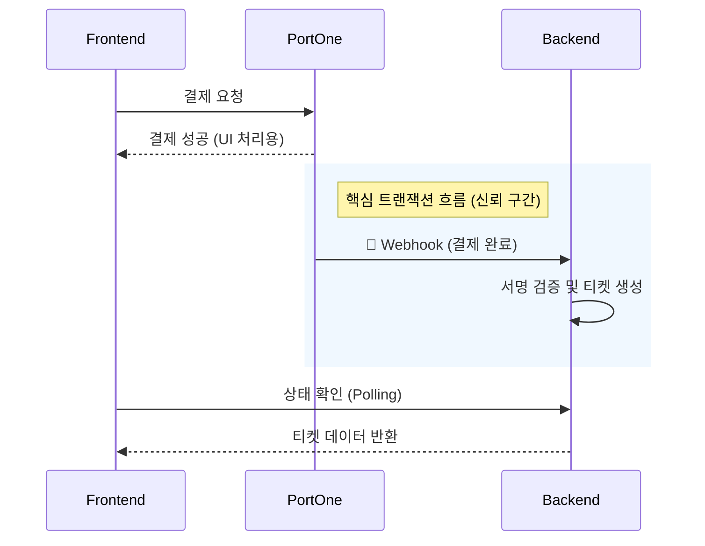

"결제되었다고 알림이 왔는데, 왜 티켓 보관함에는 티켓이 없나요?"

서비스 운영 중 난감한 CS가 접수되었습니다. 로그를 확인해 보니 결제 솔루션(PortOne) 콘솔에는 분명 `PAID` 상태로 결제 내역이 있는데, 정작 우리 서비스 DB에는 해당 주문에 대한 상품(티켓)이 생성되지 않은 상태였습니다.

이 포스팅은 **프론트엔드 중심의 결제 처리 방식**에서 발생하는 이러한 구조적 취약점을 분석하고, 이를 **Webhook 기반의 서버 주도(Server-Driven) 아키텍처**로 전환하여 결제 누락 문제를 해결한 과정을 공유합니다.

- **문제:** 결제 승인은 완료되었으나 티켓(상품)이 생성되지 않는 정합성 불일치
- **원인:** 통제 불가능한 클라이언트 환경(네트워크, 브라우저 종료 등)에 의존한 로직
- **해결:** Webhook을 통한 서버 간 신뢰성 있는 결제 완료 이벤트 수신
- **성과:** 클라이언트 상태와 무관하게 결제 성공 시 100% 주문 처리 보장

<!--truncate-->

<br />

## 1. 원인 분석: 클라이언트는 신뢰할 수 없는 환경이다

기존 결제 프로세스는 결제 완료 후속 처리를 전적으로 **프론트엔드 로직**에 의존하고 있었습니다.

1. **주문 생성:** 프론트엔드 → 백엔드 (`POST /orders`)
2. **결제 수행:** PG사 결제창 호출
3. **결제 완료 시:** 프론트엔드 → 백엔드 (`POST /orders/{id}/complete`) 호출하여 **티켓 생성**
4. **결제 실패 시:** 프론트엔드 → 백엔드 (`POST /orders/{id}/fail`) 호출

### 구조적 취약점

문제의 핵심은 **"돈을 걷는 행위(PG)"와 "물건을 주는 행위(DB)" 사이의 연결 고리가 가장 끊어지기 쉬운 '사용자 브라우저'에 있었다**는 점입니다.

- **네트워크 불안정:** 결제 직후 WiFi에서 LTE로 전환되는 등 네트워크가 불안정해 `complete` API 요청이 실패할 수 있습니다.
- **프로세스 종료:** 결제 완료 화면을 보자마자(혹은 보기도 전에) 사용자가 브라우저를 닫거나 앱을 종료하면 후속 로직이 실행되지 않습니다.

결국, **결제 검증의 주체(Source of Truth)를 클라이언트에서 서버로 이관**해야만 했습니다.

<br />

## 2. 해결 전략: Webhook 도입 (Client → Server)

프론트엔드는 결제 요청을 **트리거(Trigger)** 하는 역할에만 집중하고, 실제 결제의 완결성을 보장하는 역할은 **Webhook**을 통해 서버 간 통신(Server-to-Server)으로 처리하도록 아키텍처를 변경했습니다.

### 변경된 아키텍처

- **Frontend:** 결제창 호출 및 사용자에게 시각적 피드백 제공 (로딩/완료 화면)
- **PortOne (결제 솔루션):** 결제 상태 변경 시(Paid) 지정된 백엔드 URL로 Webhook 이벤트 전송
- **Backend:** Webhook 수신 후 서명 검증, 주문 상태 업데이트 및 **티켓 자동 생성**



:::tip 협업 포인트: 멱등성(Idempotency)
Webhook은 네트워크 이슈 등으로 인해 동일한 이벤트가 여러 번 전송될 수 있습니다. 따라서 백엔드 팀과 논의하여 **같은 결제 건에 대해 Webhook이 중복 수신되더라도 티켓이 중복 생성되지 않도록(멱등성 보장)** 로직을 설계해야 합니다.
:::

<br />

## 3. React Query를 활용한 조건부 폴링(Polling)

이 구조에서 프론트엔드의 가장 큰 과제는 **"서버 상태(Server State)와의 동기화"** 였습니다.

결제는 성공했지만 Webhook이 서버에 도달해 처리되기까지 **미세한 시간차(Race Condition)**가 발생합니다. 사용자가 결과 페이지에 도착했을 때 티켓이 아직 생성되지 않았을 수도 있다는 뜻입니다.

이를 해결하기 위해 **React Query의 `refetchInterval`** 을 활용하여 폴링을 구현했습니다. 단순 반복이 아니라, **완료 상태가 되거나 타임아웃이 될 때까지**만 조회하도록 제어했습니다.

```tsx
// 결제 상태 확인을 위한 Custom Hook example
const usePaymentStatus = (orderId) => {
  return useQuery({
    queryKey: ['payment-status', orderId],
    queryFn: () => fetchOrderStatus(orderId),
    enabled: !!orderId, // orderId가 있을 때만 실행

    // 조건부 폴링 로직: 결제가 완료될 때까지 1초마다 재요청
    refetchInterval: (data) => {
      if (data?.status === 'PAID' || data?.status === 'FAILED') {
        return false; // 폴링 중단
      }
      return 1000; // 1초 간격 폴링
    },
  });
};
```

1.  **조건부 폴링:** `PAID`나 `FAILED` 상태를 확인하면 즉시 폴링을 멈춰 불필요한 네트워크 요청을 방지합니다.
2.  **자동 동기화:** 폴링이 완료되면 React Query가 자동으로 컴포넌트를 리렌더링하여, 사용자는 별도의 새로고침 없이 최신 티켓 정보를 즉시 확인할 수 있습니다.

<br />

## 4. Before & After 비교

이번 아키텍처 개선이 가져온 변화를 표로 정리해 보았습니다.

| 항목               | 기존 방식 (Client-Driven)                       | 개선된 방식 (Server-Driven)                 |
| :----------------- | :---------------------------------------------- | :------------------------------------------ |
| **티켓 생성 주체** | 프론트엔드 (`complete` API 호출)                | 백엔드 (Webhook 이벤트 수신)                |
| **신뢰성**         | ⚠️ **불안정** (네트워크/사용자 이탈에 취약)     | ✅ **100% 보장** (서버 간 직접 통신)        |
| **결제 후 UX**     | 결제 성공 화면은 뜨지만 티켓이 없을 수 있음     | 실제 티켓 생성이 확인된 후 화면 노출        |
| **예외 상황**      | 결제 직후 브라우저 / 앱 종료 시 **티켓 미발급** | 브라우저 / 앱을 종료해도 **티켓 정상 발급** |

가장 큰 차이는 **"사용자의 행동(브라우저 종료, 네트워크 상태)이 비즈니스 로직(티켓 발급)에 영향을 주지 않게 되었다"**는 점입니다.

<br />

## 5. 결론 및 인사이트

이번 아키텍처 개선을 통해 얻은 성과는 명확합니다.

1.  **데이터 무결성 확보:** 사용자 이탈, 브라우저 종료, 네트워크 불안정과 무관하게 결제 건에 대한 티켓 생성이 100% 보장됩니다.
2.  **명확한 역할 분리:** 프론트엔드는 **UI/UX와 데이터 렌더링**에, 백엔드는 **데이터의 정합성과 트랜잭션**에 집중하게 되었습니다.

프론트엔드 개발자는 단순히 화면을 그리는 역할을 넘어, **시스템 전체의 데이터 흐름을 이해하고 더 나은 아키텍처를 제안할 수 있어야 함**을 배웠습니다.

화면 구현에만 매몰되지 않고 데이터의 전체 흐름을 추적한 덕분에, '재시도 로직 추가'라는 미봉책 대신 'Webhook 도입'이라는 근본적인 해결책을 찾을 수 있었습니다. 여러 공식 문서와 결제 프로세스를 꼼꼼히 학습하며 Webhook의 필요성을 깨달았고, 덕분에 서비스의 신뢰도를 높일 수 있었습니다.

앞으로도 기술적 시야를 넓혀, **서비스 전체의 완성도를 높이는 구조적인 개선**을 주도적으로 실천해 나가려 합니다.
